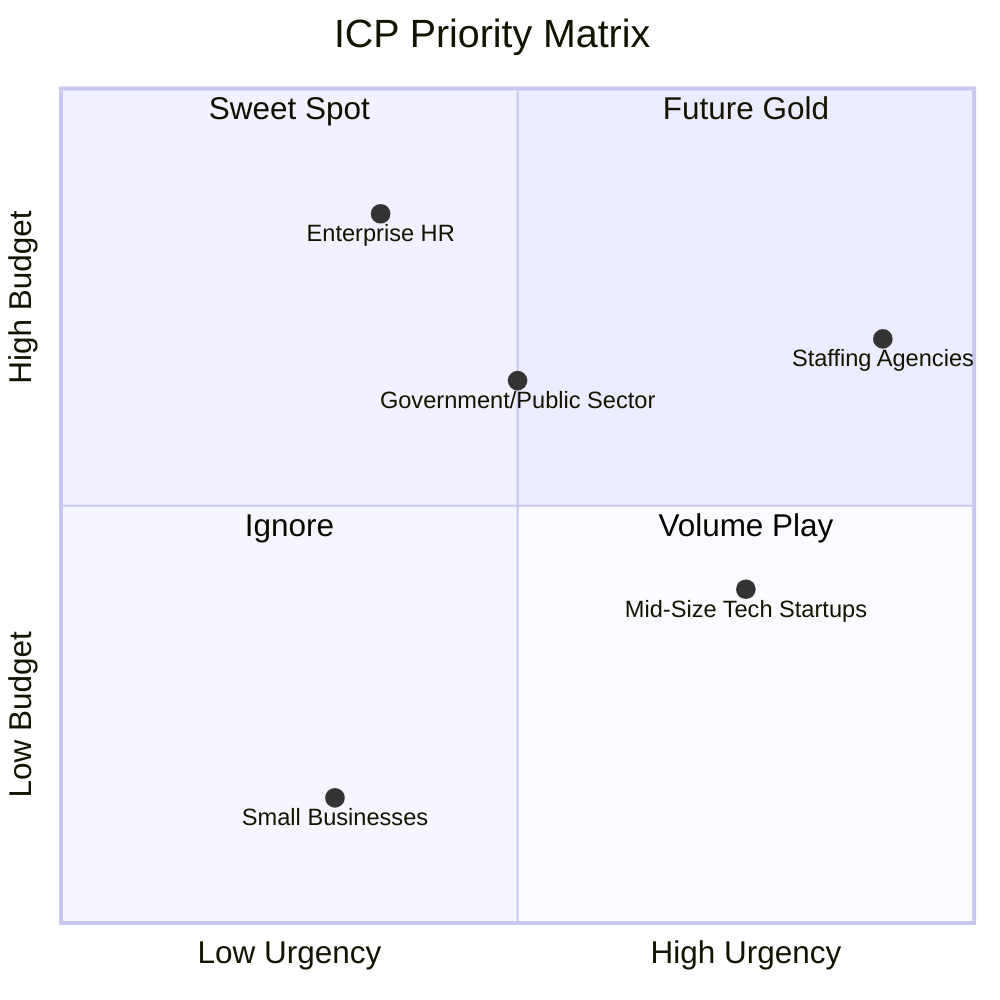
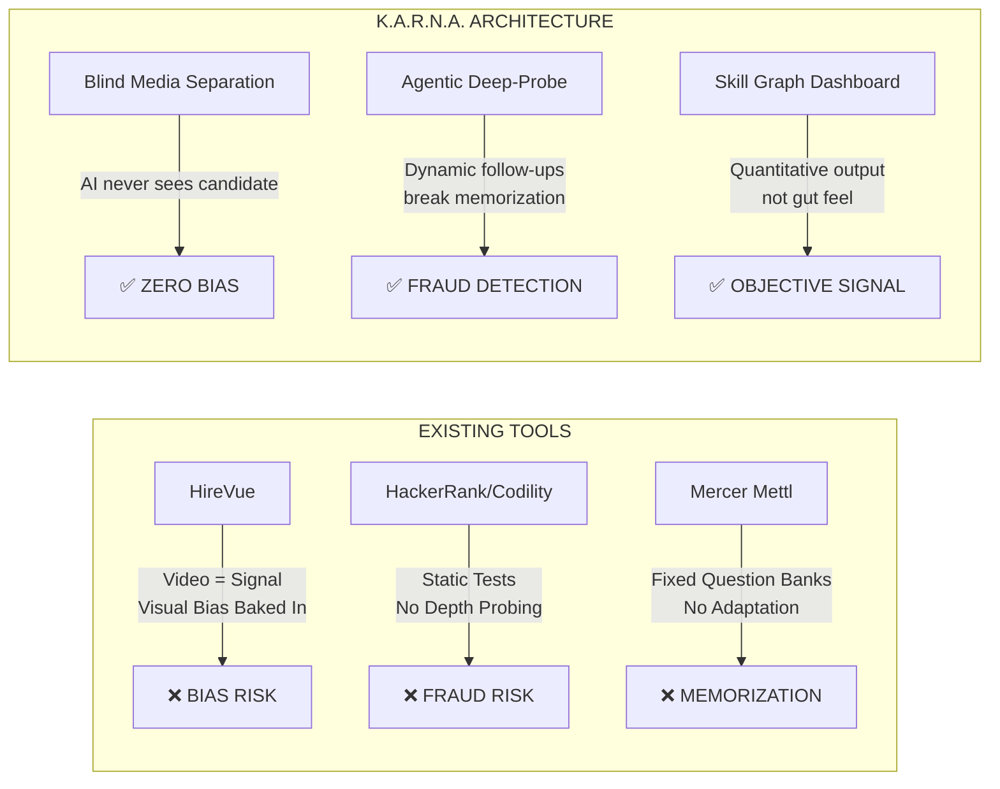
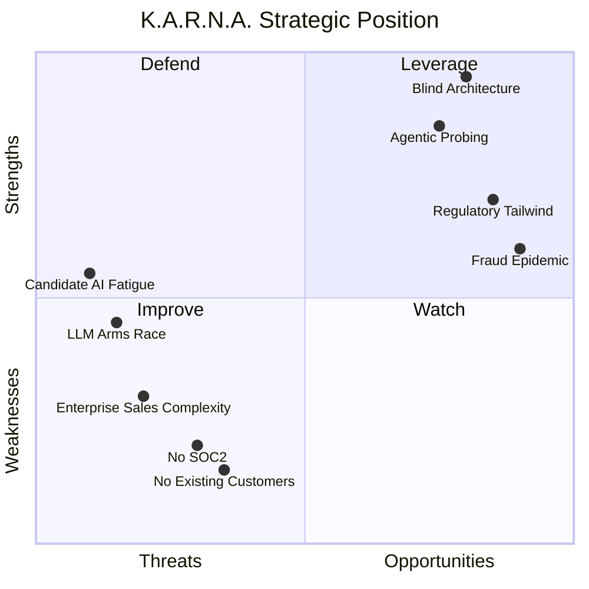

# K.A.R.N.A. — Market Validation Report

> **Prepared for:** Project K.A.R.N.A. Founding Team
> **Date:** March 27, 2026
> **Perspective:** Y-Combinator Partner / Startup Advisor / Market Analyst

---

## Executive Summary

K.A.R.N.A. enters a **$700M+ AI recruitment market** (2025) growing at 7-10% CAGR, at a moment when interview fraud has hit crisis levels (**40% of candidates cheating**, 3x increase in late 2025) and regulators are actively penalizing biased AI hiring tools. The product's architectural thesis — **blind media separation + agentic deep-probing + quantitative skill graphs** — addresses all three pain points simultaneously, which no existing competitor does.

**Verdict: This is a Painkiller, not a Vitamin.** But execution risk is high. The biggest threats are not competing products — they're candidate drop-off from "AI fatigue" and regulatory compliance overhead.

---

## 1. Target ICP (Ideal Customer Profile)

### Tier 1: 🎯 High-Volume Technical Staffing Agencies (First 10 Customers)

| Attribute | Detail |
|---|---|
| **Why them** | They screen 500-5,000 candidates/month for client roles. Every bad hire = lost client. They literally cannot afford human bias or fraud at scale. |
| **Pain intensity** | 🔥🔥🔥🔥🔥 — Proxy fraud in remote technical screening is an existential threat. 48% cheating rate in tech roles. Agencies absorb the replacement cost. |
| **Budget** | $2K-$15K/month. They already pay for HackerRank ($165-$375/mo) + HireVue ($35K-$100K/yr). K.A.R.N.A. replaces both. |
| **Decision speed** | Fast. VP of Delivery or Head of Screening can sign off. No 6-month procurement cycle. |
| **Examples** | Robert Half Technology, TEKsystems, Hays, Randstad Sourceright, TopTal |

> [!TIP]
> **The play:** Staffing agencies are the perfect design partner because they have volume, urgency, and a direct ROI metric (cost-per-bad-hire). Sign 3-5 agencies as design partners with discounted pricing. Their logo wall becomes your enterprise sales collateral.

### Tier 2: Mid-Size Tech Startups (50-500 employees)

| Attribute | Detail |
|---|---|
| **Why them** | Growing fast, hiring remote-first, small HR teams (1-3 people). Can't afford to build internal proctoring. Burned by proxy candidates. |
| **Pain intensity** | 🔥🔥🔥🔥 — One bad senior hire at a Series B startup can cost $250K+ and 6 months of wasted runway. |
| **Budget** | $500-$3K/month. Price-sensitive but willing to pay for quality signal. |
| **Decision speed** | Medium. CTO or VP Engineering often owns the hiring process. |
| **Expansion** | These companies scale rapidly. A customer at 100 employees today could be at 500 in 18 months. |

### Tier 3: Enterprise HR (1000+ employees) — Future, Not Now

| Attribute | Detail |
|---|---|
| **Why not first** | 6-12 month procurement cycles. SOC2 requirement (you don't have it). Integration with Workday/SAP SuccessFactors/Greenhouse required. Legal review of AI bias compliance. |
| **When to target** | After you have SOC2 Type II, 20+ paying customers, and a proven bias audit trail. |

> [!WARNING]
> **Do NOT chase enterprise deals before you have product-market fit with Tier 1/2.** Enterprise sales will burn your runway and distract your engineering team. Every YC graveyard is full of startups that went enterprise too early.

### ICP Decision Matrix

---

## 2. Competitor Teardown

### The Landscape

| Competitor | Category | Revenue (Est.) | Pricing | What They Do | What They DON'T Do |
|---|---|---|---|---|---|
| **HireVue** | Async Video Interview | $70-150M/yr | $35K-$145K/yr | Video interviews, I/O psych assessments, some AI scoring | ❌ No blind separation. **Video IS the signal.** Uses visual cues. Got sued for bias. |
| **HackerRank** | Technical Screener | $29-40M/yr | $1.9K-$4.5K/yr | Coding challenges, plagiarism detection | ❌ No interview simulation. Tests coding, not system design thinking or communication. Gameable. |
| **Codility** | Technical Screener | $16-25M/yr | $1.2K-$6K/yr | Code tests, live interviews | ❌ Same as HackerRank. No fraud detection beyond plagiarism. |
| **Mercer Mettl** | Assessment Platform | ~$9.5M/yr | Custom | Psychometric, cognitive, proctored tests | ❌ No agentic follow-up. Static question banks. No real-time adaptation. |
| **Interviewing.io** | Mock Interview Marketplace | <$5M/yr | Per-interview | Anonymous mock interviews with FAANG engineers | ❌ Human-dependent. Doesn't scale. No dashboard output. |

### K.A.R.N.A.'s Unique Wedge

### The Architectural Moat

No existing player has K.A.R.N.A.'s **architectural guarantee** of bias elimination. Here's why:

| Dimension | HireVue | HackerRank | K.A.R.N.A. |
|---|---|---|---|
| **Bias Elimination** | Video is the primary signal. They dropped "facial analysis" after backlash in 2021 but still use video. | N/A (text-only platform) | **Architecturally enforced.** Video is vaulted. AI receives only text. This is provable and auditable. |
| **Fraud Detection** | Weak. Detects eye movement. Easily gamed. | Plagiarism detection on code. No interview fraud detection. | **Agentic follow-ups.** If you give a memorized answer, the AI drills until it finds the boundary of your knowledge. ChatGPT can't generate real-time, contextual edge-case responses fast enough under interview pressure. |
| **Output Quality** | Subjective "recommendation" score. Black box. | Pass/fail on coding challenges. | **Quantitative Skill Graph.** Multi-dimensional, per-skill scores with explainable flags. |
| **Regulatory Posture** | Defensive. Constantly patching for compliance. | Minimal exposure (text-only). | **Compliance by design.** Blind separation = strongest possible defense against bias claims. |

> [!IMPORTANT]
> **The single most important differentiator:** K.A.R.N.A. can tell a regulator, "Our AI has never seen a candidate's face, gender, or ethnicity. It is architecturally impossible for it to discriminate on those axes." No other interview platform can make this claim.

---

## 3. Monetization Strategy

### Recommended: Hybrid Pay-Per-Interview + Platform Fee

After analyzing the pricing models of every competitor in the space, here's the frictionless path to your first 10 B2B customers:

#### Phase 1: Land (First 10 Customers)

| Model | Detail |
|---|---|
| **Free Tier** | 5 interviews/month. No credit card. Lets prospects experience the agentic depth-probe and see the Skill Graph dashboard. |
| **Pay-Per-Interview** | **$15-25 per completed interview** (5 question rounds). No commitment. No subscription. Just "try 10 interviews this month." |
| **Why this works** | Eliminates procurement friction. A VP of Recruiting can expense $250 for 10 interviews on a corporate card. No contract needed. |

> [!TIP]
> **Pricing anchor:** A single agency recruiter costs $25-35/hour. A 15-minute K.A.R.N.A. screening replaces a 45-minute human screen. At $20/interview, you're 5x cheaper than a human screen and produce a better signal.

#### Phase 2: Expand (Customers 10-50)

| Model | Detail |
|---|---|
| **Growth Plan** | $499/month — 50 interviews included ($9.98/interview effective). Additional: $15 each. |
| **Scale Plan** | $1,499/month — 200 interviews included ($7.50/interview effective). Additional: $12 each. API access for ATS integration. |
| **Why subscriptions now** | Once customers are using 20+ interviews/month, they want predictable billing. You've proven value; now capture it. |

#### Phase 3: Enterprise (Customers 50+)

| Model | Detail |
|---|---|
| **Enterprise** | Custom pricing. SOC2 compliance. Dedicated support. Custom skill graph dimensions. White-label option for staffing agencies. |
| **Success Bounty (Optional Add-on)** | $500-$1,000 bonus for every hire made through K.A.R.N.A.-validated pipeline. Only viable when you can track hire-through rates. |

### Why NOT Pure Subscription From Day 1

| ❌ Subscription-first problem | ✅ Pay-per-interview advantage |
|---|---|
| Requires long sales cycle to justify annual commitment | One decision-maker, one credit card, one afternoon |
| Prospect must estimate interview volume upfront | Pay only for what you use |
| High churn if they overpay and underuse | Usage scales naturally with hiring cycles |

### Revenue Projection (Conservative)

| Month | Customers | Avg Interviews/mo | Revenue/mo |
|---|---|---|---|
| 3 | 5 | 30 | $3,000 |
| 6 | 15 | 80 | $10,000 |
| 12 | 40 | 250 | $35,000 |
| 18 | 80 | 600 | $90,000 |
| 24 | 150 | 1,500 | $250,000 |

---

## 4. Friction Points & Regulatory Risks

### 🔴 Critical Risk: AI Hiring Regulation

The regulatory environment is moving **fast** and **against** opaque AI hiring tools. K.A.R.N.A. is better positioned than competitors, but not immune.

| Regulation | Status | Impact on K.A.R.N.A. | Mitigation |
|---|---|---|---|
| **EU AI Act** | High-risk AI in hiring enforceable by **Aug 2, 2026** | AI interview systems classified as "high-risk." Requires risk assessments, bias testing, human oversight, EU database registration. Emotion recognition **banned** since Feb 2025. | K.A.R.N.A.'s blind separation is a massive compliance advantage. But you still need: (1) documented risk assessment, (2) bias audit showing no disparate impact on protected classes via text analysis, (3) human oversight mechanism (hiring manager reviews Skill Graph, doesn't auto-reject). |
| **NYC Local Law 144** | In force since **July 2023** | Annual independent bias audit required. Public disclosure of audit results. 10-day candidate notice before AI is used. | Must commission an independent auditor. Must add candidate disclosure in the interview flow. Fines: $500-$1,500 per violation. |
| **Illinois HB 3773** | Effective **Jan 1, 2026** | Prohibits AI in hiring that results in discriminatory impact. Must notify all candidates when AI is used. Zip codes/predictive proxies banned. | K.A.R.N.A. doesn't use zip codes or visual proxies. But must add explicit notification to candidates. Keep detailed audit logs. |

> [!CAUTION]
> **The text-bias trap:** K.A.R.N.A. eliminates visual bias, but text-based AI can still exhibit linguistic bias. An LLM might rate candidates with certain vocabulary patterns, accents-reflected-in-transcription, or non-native English phrasing lower. You MUST conduct regular disparate impact testing on your Skill Graph outputs across demographic groups.

### 🟡 High Risk: Candidate Drop-Off ("AI Fatigue")

This is your **#1 adoption threat**, and it's backed by alarming data:

| Statistic | Source |
|---|---|
| **76%** of candidates have dropped out of a hiring process due to AI overuse | Nucleus Research |
| **66%** of job seekers would refuse to apply where AI heavily influences hiring | TheInterviewGuys |
| **40%** of job seekers are uncomfortable with AI in hiring | CareerPlug |
| **47%** find AI chatbots make recruitment feel impersonal | CareerPlug |
| **32.4%** report "AI screening fatigue" | TheInterviewGuys |

#### Mitigation Strategy

| Tactic | Implementation |
|---|---|
| **"AI Copilot" Framing** | Never market as "AI replaces interviewer." Position as "AI-assisted structured interview that removes bias." The AI is a tool; the human makes the decision. |
| **Candidate Warm-up UX** | Before the interview starts, show a 30-second explainer: "This interview uses AI to ensure every candidate is evaluated fairly on their answers alone — not their appearance, accent, or background." Frame it as *protecting* them. |
| **Short Sessions** | 5 questions, ~12-15 minutes. Don't force candidates through a 45-minute AI gauntlet. Respect their time. |
| **Human Touchpoint** | After the AI interview, have a brief (5-min) human check-in call before any rejection. This dramatically reduces the "robot rejected me" backlash. |
| **Transparency Dashboard** | Let candidates see a simplified version of their own Skill Graph scores. This builds trust and differentiates from black-box systems. |

### 🟡 Medium Risk: Interview Fraud Arms Race

| Risk | Detail |
|---|---|
| **LLM-assisted cheating evolves** | Today's agentic probing breaks ChatGPT cheaters. By 2027, multimodal LLMs might generate real-time, context-aware answers indistinguishable from genuine expertise. |
| **Mitigation** | Your probe engine must continuously evolve. Consider: (1) response latency analysis (LLM-assisted answers have detectable timing patterns), (2) "creative problem" questions that have no Google-able answer, (3) cross-session consistency checks for repeat candidates. |

### 🟢 Low Risk (But Worth Noting)

| Risk | Detail |
|---|---|
| **Speech-to-Text accuracy** | Google STT v2 is strong but imperfect. Candidates with thick accents may get inaccurate transcriptions → unfair evaluation. Mitigation: allow candidates to review/correct transcript before AI evaluation. |
| **Latency** | Your spec targets <7s end-to-end. LLM API latency spikes during peak hours could break this. Mitigation: queue management, fallback to cached questions, streaming responses. |

---

## 5. SWOT Analysis

| Strengths | Weaknesses |
|---|---|
| ✅ Architectural bias elimination (provable, auditable) | ❌ No paying customers yet |
| ✅ Agentic probing is genuinely novel | ❌ No SOC2/compliance certifications |
| ✅ Quantitative Skill Graph replaces subjective feedback | ❌ Dependency on Google Cloud STT + Gemini API (vendor risk) |
| ✅ Regulatory tailwind: designed for compliance | ❌ Single-session MVP (no candidate comparison) |

| Opportunities | Threats |
|---|---|
| 🔵 40% of candidates cheat — massive demand for validation | 🔴 76% candidate drop-off from AI overuse |
| 🔵 EU AI Act bans emotion recognition — competitors must rebuild | 🔴 HireVue could copy blind separation in 12 months |
| 🔵 Staffing agencies desperate for fraud-proof screening | 🔴 LLM cheating tools will get more sophisticated |
| 🔵 $700M+ market growing 7-10% annually | 🔴 Legal liability if Skill Graph scores show disparate impact |

---

## 6. The Final Verdict

### Is K.A.R.N.A. a Vitamin or a Painkiller?

## 💊 **PAINKILLER** — with one critical caveat.

### Why It's a Painkiller

The convergence of three forces makes this an **urgent necessity**, not a nice-to-have:

1. **The Fraud Crisis is Real and Accelerating.** 40% of candidates cheating. 3x increase in late 2025. Companies losing $50K-$100K+ per fraudulent hire. Google, McKinsey, and Cisco are reverting to in-person interviews — a $5K+/candidate cost. K.A.R.N.A. offers a digital alternative that's 10x cheaper.

2. **The Regulatory Hammer is Falling.** EU AI Act high-risk enforcement drops August 2026. NYC LL144 audits are intensifying. Illinois HB 3773 is live. Every company using HireVue or unaudited AI is a lawsuit waiting to happen. K.A.R.N.A.'s blind architecture is the strongest compliance story in the market.

3. **The Market Timing is Perfect.** Mass layoffs → more applicants per role → more screening load → more fraud → more need for automated validation. This is a countercyclical product. When hiring slows, screening quality matters *more*, not less.

### The Critical Caveat

> [!WARNING]
> **You must solve the candidate experience problem or you will die.** Your buyer (the recruiter) loves you. Your user (the candidate) might hate you. 76% candidate drop-off from AI overuse is not a minor friction — it's an existential threat. If top talent refuses to take AI interviews, your buyers lose their best candidates, and they'll blame you.
>
> **Priority #1 after MVP:** Invest heavily in candidate UX. The interview must feel fair, short, and respectful. The "bias-free" narrative must be communicated TO the candidate, not just to the buyer.

### What I'd Need to See Before Writing a Check

If I were sitting across the table from you at YC office hours, I'd ask:

| Question | Why It Matters |
|---|---|
| Can you show me 5 staffing agency interviews where 100% said "I'd pay for this"? | Product-market fit signal. |
| What's your candidate completion rate in pilot tests? | If it's below 80%, you have a UX problem. |
| Have you run a disparate impact analysis on your Skill Graph outputs? | Regulatory audit readiness. |
| What happens when Gemini hallucinates or asks an unfair question? | LLM reliability in high-stakes decisions. |
| Who on your team has sold B2B SaaS to HR/staffing before? | Domain expertise in GTM. |

---

## 7. Recommended Next Steps (90-Day Sprint)

| Week | Action | Deliverable |
|---|---|---|
| 1-2 | Ship hackathon MVP | Working demo with blind separation + agentic probe + Skill Graph |
| 3-4 | Run 20 mock interviews with real candidates | Candidate completion rate data + NPS scores |
| 5-6 | Approach 10 staffing agencies for design partnership | 3-5 signed LOIs (Letters of Intent) |
| 7-8 | Conduct disparate impact analysis on Skill Graph outputs | Bias audit report (internal, not independent yet) |
| 9-10 | Implement candidate notification + consent flow | Regulatory compliance for NYC LL144 + Illinois |
| 11-12 | Launch pay-per-interview pricing with 3 pilot customers | First revenue + usage metrics |

---

*This report is based on market data available as of March 2026. Market conditions, regulatory frameworks, and competitor positioning may change rapidly. Regular reassessment is recommended.*
